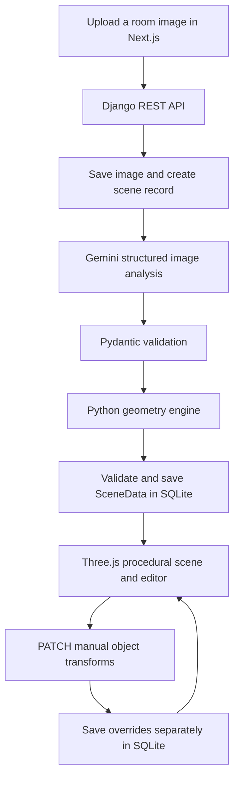

# Spatialize: Vision-guided spatial reasoning for interactive 3D scene reconstruction

Spatialize is a full-stack application that transforms a room photograph or illustration into an interactive 3D scene that can be explored and refined directly in the browser.

The system analyzes the input image to identify visible furniture, estimate spatial relationships, and reconstruct an approximate room layout. Users can compare the generated scene with the original image, switch between camera views, and manually move or rotate objects to improve the reconstruction.

Spatialize combines Gemini's visual understanding with a Python-based geometry engine and procedural Three.js models. Rather than attempting photorealistic reconstruction, the project focuses on understanding and visualizing the spatial arrangement of a room in an editable 3D environment.

Because the scene is inferred from a single 2D image, object dimensions, depth, camera placement, and some furniture geometry are estimated or based on predefined model dimensions. The result is therefore an interpretable approximation of the original room rather than an exact digital replica.


## What you can do

- **Generate a scene from an image.** Upload a JPG, PNG, or WebP room image through the web interface.
- **Explore the room in 3D.** Orbit, pan, and zoom; switch between the estimated source camera, an overview, and a top view. Camera-facing walls disappear to expose the interior.
- **Compare with the original.** View the source image alongside the generated scene.
- **Edit the layout.** Select an object, move it across the floor plane, or rotate it around the vertical axis using handles or numeric inputs.
- **Keep your adjustments.** Edits save automatically, failed saves can be retried, and individual objects can be reset to their generated transforms.
- **Reopen a saved scene.** The URL retains a `?scene=<id>` parameter so refreshing or revisiting it restores the scene and saved edits while the same backend data remains available.
- **Inspect placement decisions.** The placement-details view exposes detected boxes, floor anchors, projected positions, confidence values, and geometry warnings.

### Supported objects

| Object types | Current rendering |
| --- | --- |
| Bed, sofa, desk, chair, lamp, plant, bookshelf | Dedicated procedural models |
| Table | Reuses the desk model |
| Window | Framed model mounted on an inferred wall |
| Rug | Thin floor covering using its detected dominant fabric color, when available |
| Cabinet, TV, generic | Simple box models |

Windows are placed separately from furniture so they remain above the floor. Rugs can sit beneath furniture without pushing it away. Bookshelf contents are part of the bookshelf model rather than individually reconstructed objects.

## How it works



1. **Image analysis:** The backend sends the uploaded image to Gemini and requests structured observations: object types, normalized bounding boxes, floor-contact points, floor corners, orientations, support relationships, and spatial relationships. EXIF orientation is accounted for so image coordinates match the browser's displayed image.
2. **Floor mapping:** Valid floor corners define a homography—a transformation from image points to positions on the room's floor. Three corners can complete an affine floor mapping only when an orthographic projection is explicitly indicated. Otherwise, incomplete or invalid landmarks use a declared camera/floor prior. An optional, single focused Gemini refinement attempts to improve unusable or incomplete floor landmarks.
3. **Geometry:** The engine maps object anchors onto a canonical room, assigns dimensions from object-type defaults, applies wall and support constraints, and makes bounded semantic and collision corrections. Windows use image-to-wall projection when possible; rugs use floor-center anchors.
4. **Camera estimation:** The same floor mapping supplies an approximate perspective or orthographic camera. Unusable camera estimates fall back to an overview prior.
5. **Rendering:** The frontend creates procedural assets, normalizes each asset to the backend's bounding box, and applies its rotation and position. No generated mesh file needs to be downloaded.
6. **Editing:** User changes become a separate map of object transforms. The backend validates object IDs, finite values, and rotated room bounds before saving them.

Generation runs inside the upload request. The record moves from `processing` to `completed` or `failed`; these statuses do not represent a background job queue.

## Architecture and tradeoffs

These are the main design choices reflected in the implementation.

| Decision | Benefit | Tradeoff |
| --- | --- | --- |
| Separate visual understanding from geometry | Gemini supplies image observations; Python owns dimensions, coordinate conversion, and placement rules. Geometry can be replayed and tested independently. | Incorrect detections or landmarks still affect the final layout. |
| Use a fixed canonical room and semantic size defaults | Establishes a consistent scene scale without asking the model to invent physical measurements. | Actual room proportions and furniture dimensions are not recovered. |
| Prioritize image anchors and limit corrective movement | Semantic rules and collision handling can improve placement without moving objects arbitrarily far from observed locations. | Some overlaps and contradictory relationships remain and are reported in debug data. |
| Share an explicit coordinate contract | Backend geometry, frontend models, camera projection, and edit validation use the same conventions. | Python and TypeScript schema definitions must be kept aligned. |
| Build assets procedurally with Three.js | Each supported type has a reusable model that can be centered, scaled, selected, and edited consistently. | Shapes and most materials are predefined rather than reconstructed from the image. |
| Keep generated data separate from manual overrides | Resetting an object is straightforward, and editing preserves the original generated scene and its diagnostics. | Edits do not recompute support relationships, camera fitting, or collision resolution. |
| Use a separate Next.js client and Django REST backend | UI/rendering and image analysis/geometry have clear boundaries connected by JSON. | Local development needs two servers and cross-origin requests. |
| Use synchronous processing, SQLite, and local media storage | Keeps the MVP's infrastructure small and easy to run locally. | Slow model calls occupy the request; shared hosting and concurrent workloads need additional infrastructure. |
| Store placement diagnostics and support offline replay | A saved analysis can reproduce geometry without another model call, making placement issues easier to investigate. | Scene payloads include substantial diagnostic data; there is no dedicated compact production response. |

### Coordinate and data contract

The canonical room is **5 units wide × 3 units high × 5 units deep**. These are layout units, not measured meters, even though the current editor labels position fields with `(m)`.

- The origin is at the center of the floor; the floor surface is `Y = 0`.
- `+X` points right, `+Y` points up, and `+Z` points toward the front of the room.
- Object positions describe bounding-box centers.
- Width, height, and depth describe the local box before rotation.
- `rotation_y` is in degrees; an unrotated object's front faces `+Z`.
- Image coordinates are normalized to `[0, 1]`, with the origin at the top-left.

The versioned convention is `floor_center_y_up_positive_z_front_v1`. Generated JSON contains `canonical_room`, `coordinate_convention`, `objects`, `camera`, and `debug_info`. Legacy saved data using `room_size_hint` is still readable.

Each database scene stores the uploaded image path, generated `scene_data`, separate `manual_overrides`, status, and creation time. An override contains only `x`, `z`, and `rotation_y`, keyed by an existing object ID.

## Technology stack

| Layer | Technologies |
| --- | --- |
| Web interface | Next.js 16, React 19, TypeScript, Tailwind CSS 4 |
| 3D viewer and editing | Three.js, OrbitControls, TransformControls |
| API and persistence | Django, Django REST Framework, SQLite |
| Image analysis | Google Gen AI Python SDK / Gemini |
| Validation and image handling | Pydantic 2, Pillow, python-dotenv |
| Development checks | Bun tests, Django/unittest tests, TypeScript, ESLint, Prettier, Ruff |

## Run locally

### Prerequisites

- Python **3.12 or newer**. The existing local backend environment uses Python 3.14.
- Node.js **20.9 or newer** and Bun. The client declares Bun **1.3.14** as its package manager.
- A Gemini API key and access to a model that accepts images and structured JSON output.
- A browser with WebGL support.

The commands below assume a Unix-like shell and start from the repository root.

### 1. Set up the backend

```bash
cd server
python3 -m venv venv
source venv/bin/activate
python -m pip install --upgrade pip
python -m pip install \
  Django==6.1 \
  djangorestframework==3.18.0 \
  django-cors-headers==4.9.0 \
  google-genai==2.20.0 \
  pydantic==2.13.5 \
  Pillow==12.3.0 \
  python-dotenv==1.2.3
```

These direct dependency versions reflect the existing development environment. The repository does not yet contain a backend runtime requirements file or dependency lock; `server/requirements-dev.txt` currently contains only Ruff, and `server/pyproject.toml` configures Ruff.

Create or update `server/.env` with your own settings, replacing the placeholders:

```dotenv
GEMINI_API_KEY=your_api_key_here
GEMINI_MODEL=your_available_image_capable_model_id
GEMINI_FALLBACK_MODELS=
```

| Variable | Behavior |
| --- | --- |
| `GEMINI_API_KEY` | Used by the backend when analyzing an image. |
| `GEMINI_MODEL` | Primary model ID. If absent or blank, the code uses `gemini-3.8-flash`. |
| `GEMINI_FALLBACK_MODELS` | Comma-separated model IDs to try in order. An explicitly empty value disables model switching. If omitted, defaults are drawn from the remaining configured sequence: `gemini-3.8-flash`, `gemini-3.7-flash`, `gemini-3.6-flash`, `gemini-3.5-flash`. |

The names above describe the defaults in the source code; model availability depends on your API access. Set an available model explicitly. Fallbacks apply to selected unavailable/transient API responses (`404`, `408`, `429`, `500`, `502`, `503`, `504`). Authentication errors, invalid requests, and invalid structured output fail the initial analysis rather than triggering model switching.

Start the backend from `server/` with the virtual environment active:

```bash
python manage.py migrate
python manage.py runserver 127.0.0.1:8000
```

The health endpoint is `http://127.0.0.1:8000/api/ping/`.

### 2. Start the frontend

In a second terminal, from the repository root:

```bash
cd client
bun install --frozen-lockfile
bun run dev
```

Open `http://localhost:3000`, choose a room image, and select **Generate Model**. Generation needs network access to Gemini. Uploaded images are stored in `server/media/scenes/` and sent to Gemini for analysis; scene records are stored in `server/db.sqlite3`.

The frontend currently uses `http://127.0.0.1:8000` directly in [`page.tsx`](client/app/page.tsx) and [`sceneApi.ts`](client/lib/sceneApi.ts). There is no API-base-URL environment variable yet. Running the backend elsewhere requires updating both locations.

### Viewer controls

| Action | Control |
| --- | --- |
| Explore the scene | Orbit, pan, and zoom using mouse/touch controls |
| Change view | **Source**, **Overview**, or **Top** |
| Select an object | Click its visible model |
| Move the selection | **Move** or `G`, then drag the arrows or floor handle |
| Rotate the selection | **Rotate** or `R`, then drag the rotation handle |
| Enter an exact transform | Edit X, Z, or Y rotation; press Enter or leave the field |
| Restore generated placement | **Reset object** |
| Deselect | `Esc` or the panel's close button |
| Inspect reconstruction | **Placement details** |

Edits save after a drag or numeric change is committed. Check for **Saved** before leaving; use **Retry** if a save fails.

## API

| Method | Endpoint | Purpose |
| --- | --- | --- |
| `GET` | `/api/ping/` | Health check |
| `POST` | `/api/scenes/` | Upload an image as multipart form data under `image`; analyze and generate a scene synchronously |
| `GET` | `/api/scenes/<id>/` | Retrieve the image URL, generated data, overrides, status, and creation time |
| `PATCH` | `/api/scenes/<id>/` | Replace a completed scene's entire manual override map |

Example upload:

```bash
curl -F "image=@/path/to/room.jpg" http://127.0.0.1:8000/api/scenes/
```

Example edit payload, using an actual object ID from the scene:

```json
{
  "manual_overrides": {
    "chair_1": { "x": 0.5, "z": 1.0, "rotation_y": 90 }
  }
}
```

Include all overrides you want to retain in each PATCH. Sending `{"manual_overrides": {}}` resets every object to its generated transform. Generated scene data cannot be changed through this endpoint. Invalid IDs, unsupported fields, nonfinite values, and transforms whose rotated footprints leave the room are rejected.

There are no scene-list or scene-delete API endpoints in the MVP.

## Tests and offline replay

Run the backend suite from `server/` with the virtual environment active:

```bash
python -B manage.py test scenes
```

Run frontend tests and static checks from `client/`:

```bash
bun run test
bun run typecheck
bun run lint
```

Frontend geometry-contract tests invoke `server/venv/bin/python`, so create the backend environment at that path before running them. Tests cover floor mapping and fallback behavior, wall/support constraints, bounded collision correction, windows and rugs, model fallback handling, API persistence, manual transform validation, and agreement between Python geometry and Three.js rendering. Automated model calls are mocked; these tests do not measure live Gemini detection accuracy.

To generate scene JSON from a committed fixture without API credentials or database writes, run from `server/`:

```bash
python -B -m scenes.replay \
  --input scenes/fixtures/basic_room_annotated.json \
  --output /tmp/spatialize-scene.json
```

The same tool accepts `--image /path/to/room.jpg` instead of `--input` to run live analysis. That mode calls Gemini and also writes a `.analysis.json` file beside the output for later replay.

For an optional browser preview of replayed geometry, run from `client/`:

```bash
bun run build
node scripts/preview-scene.mjs /tmp/spatialize-scene.json /path/to/source-image.jpg
```

This opens a preview server at `http://127.0.0.1:3099`; open that address in your browser. Use the image corresponding to the analysis being replayed. The script requires a Node.js version with `node:fs.globSync` and uses CSS from the production build. The build uses Google fonts through `next/font/google`, so font fetching may require network access. Replay previews do not persist edits because they have no saved scene ID.

## Current limitations: There are a lot :(

- **Approximate reconstruction.** A single image does not establish physical scale or hidden geometry. The fixed room and object dimensions can distort the source room's proportions. This MVP is unsuitable for measurement-dependent planning.
- **Rectangular room assumption.** Floor mapping assumes a rectangular planar patch. Nonrectangular rooms, unusual camera projections, heavy occlusion, and cropped floor boundaries can lead to inaccurate placement or fallback estimates.
- **Detection and camera uncertainty.** Objects may be missed or misclassified, wall labels can be wrong, and bounding-box bottoms are imperfect substitutes for floor contacts. The source view is an estimate and may fall back to an overview.
- **Limited appearance reconstruction.** Most furniture colors, materials, and shapes come from the asset library. Rugs preserve only a dominant color; source textures, detailed patterns, lighting, and exact furniture designs are not reconstructed. Windows are mounted models, without openings cut into the wall mesh.
- **Bounded collision handling.** Generated placements use bounding-box approximations and limited corrections, so intersections can remain. The engine records unresolved conflicts rather than guaranteeing a collision-free scene.
- **Basic manual editing.** Only X/Z translation and Y-axis rotation are editable. There is no resizing, vertical movement, object addition/deletion, undo/redo, or mesh export. Edits enforce room bounds but do not prevent object overlaps or preserve wall/support attachments; moving a desk does not automatically move an object resting on it.
- **External inference dependency.** New uploads require a working Gemini key, network access, model availability, and quota. Model calls introduce latency and usage costs; fallback attempts and floor refinement can add calls. The UI shows a loading state without progress stages or cancellation.
- **Local persistence and single-request processing.** SQLite and local files need to persist together. There is no background worker, object storage, scene gallery, multiuser ownership, or concurrency/version control for edits. Competing clients can overwrite the same override map.
- **Development configuration.** Django currently enables debug mode and all-origin CORS, uses a development secret key, and has no scene-level authentication or authorization. Anyone who can reach the API can retrieve or edit a scene by ID. A public deployment needs production configuration and access control.
- **Setup reproducibility.** Frontend dependencies have a Bun lockfile; backend runtime dependencies are not yet recorded in a dedicated manifest/lockfile. The repository also tracks a local SQLite database and `server/.env`; real credentials should not be published with the repository.

## Repository guide

```text
client/
  app/                         Upload page, layout, and global styles
  components/
    SceneViewer.tsx             Three.js lifecycle, camera views, and diagnostics
    SceneEditPanel.tsx          Object transform controls in the UI
    generators/                Procedural furniture, window, and rug models
  lib/
    SceneData.ts               Frontend scene types and coordinate convention
    sceneBuilder.ts            Asset normalization, room construction, and cameras
    sceneEditor.ts             Object picking and Three.js transform controls
    manualTransforms.ts        Rotation-aware room bounds
    useManualOverrides.ts      Save state, queued writes, and retry handling
    sceneApi.ts                Scene retrieval and override updates
  tests/                       Rendering contract and manual transform tests
  scripts/                     Standalone geometry preview
server/
  config/                      Django settings and root URL routing
  scenes/
    vlm_service.py             Gemini prompt, structured output, and fallbacks
    schemas.py                 Pydantic analysis and scene contracts
    floor_mapping.py           Image-to-floor mapping and explicit priors
    geometry_engine.py         Placement, dimensions, constraints, and diagnostics
    camera_geometry.py         Approximate source-camera fitting
    window_geometry.py         Wall-mounted window placement
    validators.py              Final scene bounds validation
    models.py                  Scene persistence
    serializers.py             API payload and override validation
    views.py                   Upload, retrieval, and update endpoints
    replay.py                  Offline fixture/live-image geometry replay
    fixtures/                  Saved analysis inputs for reproducible checks
    migrations/                Database schema history
    test*.py                   Geometry, inference, and API tests
```

To add an object type, update the backend schema and size defaults, add its frontend generator and registry entry, and extend the geometry/rendering contract tests. Placement changes belong in the Python geometry modules; the frontend consumes their output using the shared coordinate convention.
